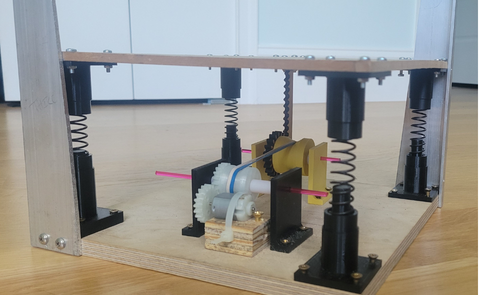

# Kinetic Energy Tile -[Apr 2025]  
A tile that provides limited electricity from the work done by a human footstep! 
## Purpose:  
- Design and build a tile that can generate electricity from a human footstep within 2 weeks  
- Demonstrate an application of mechanics concepts for my EOY Physics I presentation
   
    
Video^^: (https://www.youtube.com/watch?v=fjJjNncEHaI)  

## Mechanics Concepts Chosen: 
- Linear movement can be converted to rotational due to conservation of energy(Rack + Pinion)  
- Linear velocity is the same at all segments of a belt
- Since torque is dependent on radius, changing pulley diameter is similar to using gears. 
- The spring coeffecient helps properly distribute weight under the foot
- The restorative force of the spring does negative Work, allowing electricity to be generated while the user steps on and off
- A gear train was considered for this project(to increase output) however, due to the time constraint pulleys were chosen instead   
[View calculations/documentation](Photo/KE_Tile_FinalProject.pdf)

## Prototyping:  
- A rough 3D model was created using Onshape 
- Designed cup-mounts for each spring, a Rack & Pinion, and pulleys that tight-fit snapped into gears
- Laser cut and 3D printed mechanical subsystems  
- Used a Drill Press to create fastener holes in the wooden platform bases and metal supports
  [Onshape Models](CAD)   
## Flaws & Improvements: 
- The springs were designed to sit on cups, after I drew inspiration from car suspension. However, this created instability. Unlike a car, the motion of the KE tile had to be constrained in X and Z.
- A belt should've been used instead of rubberbands, as the energy from the pinion pulley was partially transferred to the rubberband instead of the generator gear. Additionally, constant linear velocity does not apply to elastics.
If I were to make a KE Tile 2.0 I'd consider:  
- Adding a compound gear train can be added.  
- Using Piezoelectric crystals instead of a purely mechanical design  
- Adding capacitors  
- Adding a circuit capable of charging my phone   
